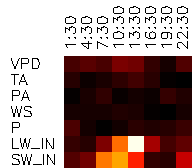

# FluxFormer
Using transformer to estiamte daily average LE.
<p align="left">
  
</p>  


The inputs includes ``VPD, TA, PA, WS, P, LW_IN, SW_IN`` from times ``1:30, 4:30, 7:30, 10:30, 13:30, 16:30, 19:30, 22:30``.  
The transformer is used to estimate the daily average ``LE``.  
The image above shows the attention map of the input values, brighter means higher attention.  
The ``LW_IN`` and ``SW_IN`` at noon have the highest attention.


## Setup
```
pip install -r requirements.txt
```

## Usage

1. prepare the data in csv files:  
    ```bash
    /path/to/data_dir
        - FLX_AT-Neu.csv
        - FLX_AU-Ade.csv
        - FLX_AU-ASM.csv
        - FLX_AU-Cpr.csv
        - FLX_AU-Cum.csv
        ...
    ```
2. link the data_dir to local directory
    ```bash
    ln -s /path/to/data_dir data
    ```

3. train the model
    ```bash
    export WANDB_MODE=disabled && python train.py --train_split debug.txt --test_split debug.txt
    ```
    The model parameters will be saved in ``checkpoints`` dir. 

4. eval the model
    ```bash
    python eval.py
    ```
    The results and attention map visualization will be saved in ``output`` dir.